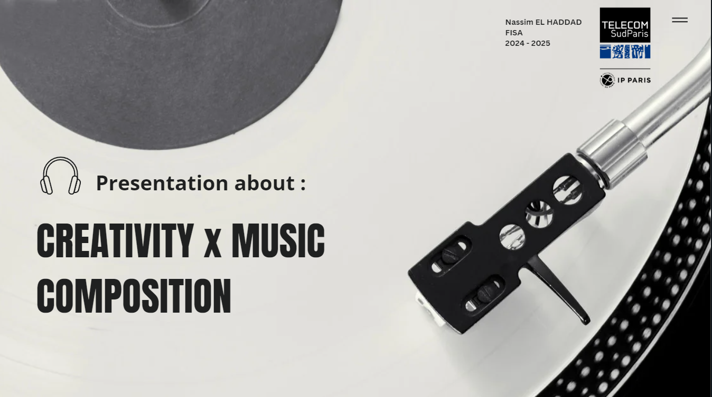

# Présentation du Projet | Project Presentation

## FR : 

Ce projet illustre une présentation sur l’évolution du processus créatif dans la composition musicale à travers les époques, réalisée dans le cadre d’un cours d’anglais de niveau C1-C2 à Télécom SudParis. Nous avons exploré les approches des compositeurs de différentes périodes, comme l’époque classique, romantique et le 20e siècle, en mettant en lumière leurs innovations et influences.

### Contenu de la Présentation

1. Aperçu historique du processus créatif dans la musique.
2. Analyse des styles et des techniques de composition à travers les époques.
3. Mise en lumière des figures emblématiques et de leurs œuvres.
4. Réflexion sur l’évolution des outils et technologies influençant la création musicale.

### Objectif Pédagogique

Cette présentation vise à enrichir notre compréhension de la musique comme art évolutif, tout en renforçant nos compétences en communication académique en anglais.

---

## ENG : 

This project showcases a presentation on the evolution of the creative process in musical composition across different eras, prepared for a C1-C2 English course at Télécom SudParis. It explores the approaches of composers from periods such as the Classical, Romantic, and 20th-century eras, highlighting their innovations and influences.

### Presentation Content

1. Historical overview of the creative process in music.
2. Analysis of compositional styles and techniques over time.
3. Spotlight on iconic figures and their works.
4. Reflection on the evolution of tools and technologies impacting musical creation.

### Educational Objective

The presentation aims to deepen our understanding of music as an evolving art form while enhancing our academic communication skills in English.

---

## Ce que j'ai appris | What I Learned

## FR :

À travers ce projet, j'ai développé mes compétences en communication académique en anglais (niveau C1-C2) et approfondi ma compréhension de l’histoire de la musique. J’ai appris à analyser des courants musicaux, à identifier les ruptures dans les styles de composition, et à structurer une présentation claire et engageante.

## ENG :

Through this project, I honed my academic communication skills in English (C1-C2 level) and deepened my understanding of music history. I learned to analyze musical movements, identify shifts in compositional styles, and structure a clear and engaging presentation.

---

## Auteurs | Authors

- [Nassim EL HADDAD](https://www.linkedin.com/in/nassim-el-haddad-4aa298271/)

---

### Liens Utiles | Useful Links

- [L’Histoire de la Musique](https://www.musicologie.org/)
- [BBC Music History](https://www.bbc.co.uk/music/genres/classical)
- [Télécom SudParis](https://www.telecom-sudparis.eu/)

### Image

